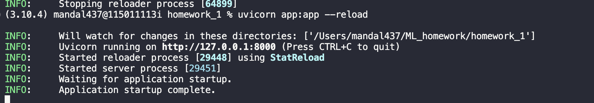
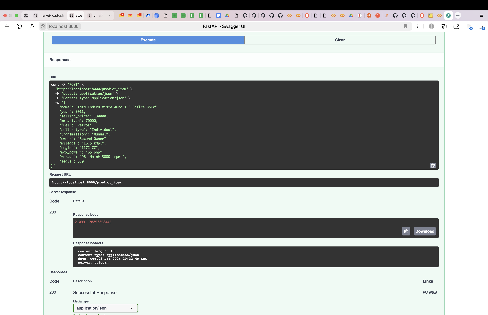

### Содержание работы
- В данной работе было выполнено EDA
- Данные были подготовлены к обучение моделей линейной регрессии на них
- Было обучено несколько моделей, который были сравнены по MSE
- Был реализован сервис при помощи FastApi
